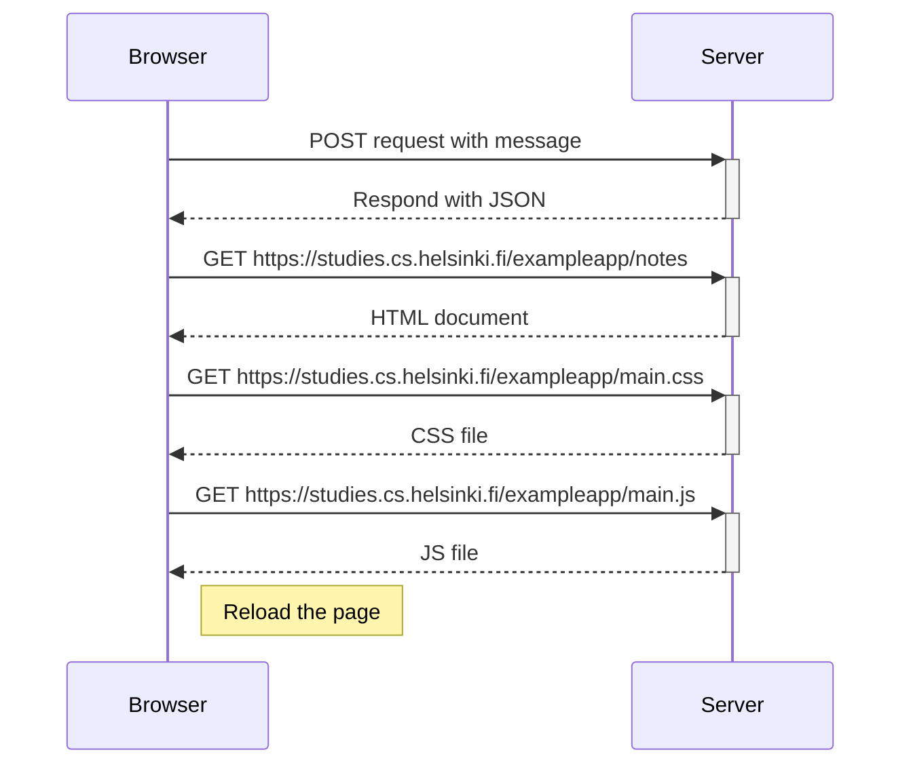

```mermaid
sequenceDiagram
participant Browser
participant Server
    Browser->>+Server: POST request with message
    Server-->>-Browser: Respond with JSON
    Browser->>+Server: GET https://studies.cs.helsinki.fi/exampleapp/notes
    Server-->>-Browser: HTML document
    Browser->>+Server: GET https://studies.cs.helsinki.fi/exampleapp/main.css
    Server-->>-Browser: CSS file
    Browser->>+Server: GET https://studies.cs.helsinki.fi/exampleapp/main.js
    Server-->>-Browser: JS file
    Note right of Browser: Reload the page
```
