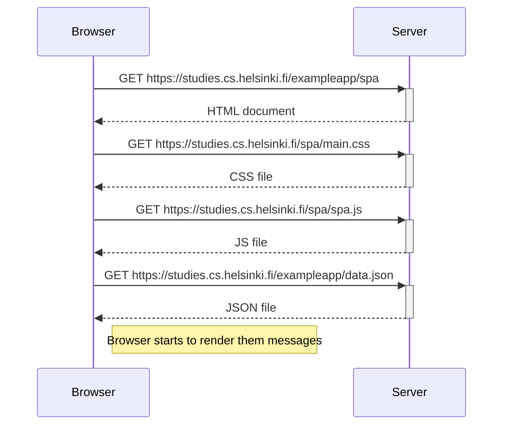

```mermaid
sequenceDiagram
participant Browser
participant Server
    Browser->>+Server: GET https://studies.cs.helsinki.fi/exampleapp/spa
    Server-->>-Browser: HTML document
    Browser->>+Server: GET https://studies.cs.helsinki.fi/spa/main.css
    Server-->>-Browser: CSS file
    Browser->>+Server: GET https://studies.cs.helsinki.fi/spa/spa.js
    Server-->>-Browser: JS file
    Browser->>+Server: GET https://studies.cs.helsinki.fi/exampleapp/data.json
    Server-->>-Browser: JSON file
    Note right of Browser: Browser starts to render them messages
```
